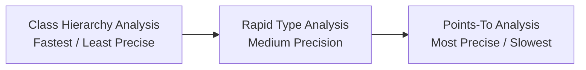

# Concept: Call Graph Construction

## Definition
A **Call Graph (CG)** is a directed graph representing execution flow between methods in a computer program. 
*   **Nodes**: Represent methods (in SootUp, mapped by `MethodSignature`).
*   **Edges**: Represent call sites. An edge `A -> B` indicates that method `A` invokes method `B`.

---

## Why It Matters in Static Analysis
To check for security vulnerabilities, we must trace user input across method boundaries (e.g. input comes into `Controller.handle(...)`, gets passed to `UserService.validate(...)`, which passes it to `DatabaseAccessor.query(...)`). 

Without a Call Graph, we can only perform **intraprocedural analysis** (analyzing one method at a time). A Call Graph enables **interprocedural analysis** (following flow across the entire program structure).

---

## Call Graph Resolution Algorithms
Since polymorphic virtual calls (like `receiver.execute()`) can target different subclass overrides at runtime, static analysis tools use approximation algorithms to estimate the callee.



### 1. Class Hierarchy Analysis (CHA)
CHA resolves virtual calls by examining the static type of the receiver and checking the class hierarchy. It assumes that *any* subclass that overrides the method could be the runtime target.
*   **Pros**: Extremely fast to calculate; doesn't require analyzing instantiations.
*   **Cons**: Oversimplifies. If a class has 20 subclasses, CHA assumes all 20 methods are potential targets, creating "spurious edges" that don't occur at runtime.

### 2. Rapid Type Analysis (RTA)
RTA improves on CHA by tracking which classes are instantiated (via `new` expressions) across the reachable parts of the program. It only resolves virtual calls to methods of classes that are actually instantiated.

### 3. Points-To Analysis (Spark)
Points-to analysis determines which runtime heap objects a reference variable can point to. It creates the most precise call graph but is computationally expensive.

---

## 🛠️ SootUp Call Graph API usage
In SootUp 2.0.0, Call Graph construction is highly modularized under the `sootup.callgraph` dependency.

### Basic Steps to Build a CHA Call Graph
1.  **Define Entry Points**: The analysis engine needs starting nodes (usually the `main` method of an application or lifecycle hooks in Android/web frameworks).
2.  **Initialize Algorithm**: Pass the `JavaView` containing loaded code representation to the CHA constructor.
3.  **Traverse & Query**: Traverse the graph edges.

**SootUp CHA Code Example:**
```java
// Define entry method signature
IdentifierFactory factory = view.getIdentifierFactory();
ClassType targetClass = factory.getClassType("com.vulnfinder.TargetCode");
MethodSignature entryPoint = factory.getMethodSignature(
    targetClass, 
    "main", 
    "void", 
    Collections.singletonList("java.lang.String[]")
);

// Instantiate CHA Algorithm
CallGraphAlgorithm algorithm = new ClassHierarchyAnalysisAlgorithm(view);

// Build Call Graph starting from the entry points
CallGraph cg = algorithm.initialize(Collections.singletonList(entryPoint));

// Inspect outgoing calls
Set<CallGraphEdge> outgoingEdges = cg.callsFrom(entryPoint);
for (CallGraphEdge edge : outgoingEdges) {
    System.out.println("Caller: " + edge.getSource() + " -> Callee: " + edge.getTarget());
}
```

---

## 🎯 Application in `sootup-vulnfinder`
Here static analysis engine will construct a CHA Call Graph starting from `TargetCode.main` to discover call paths. 
When tracing user inputs:
1. If method `A` passes parameter `p` (tainted) to method `B` as argument `arg0`, we trace the call graph edge `A -> B` and mark parameter 0 of method `B` as tainted.
2. We continue taint analysis inside `B` to see if it eventually hits a security sink.
